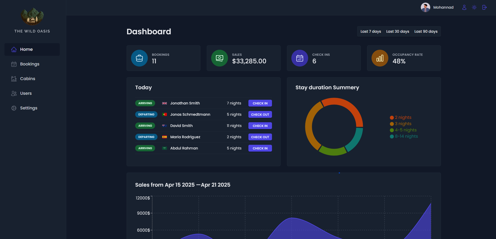
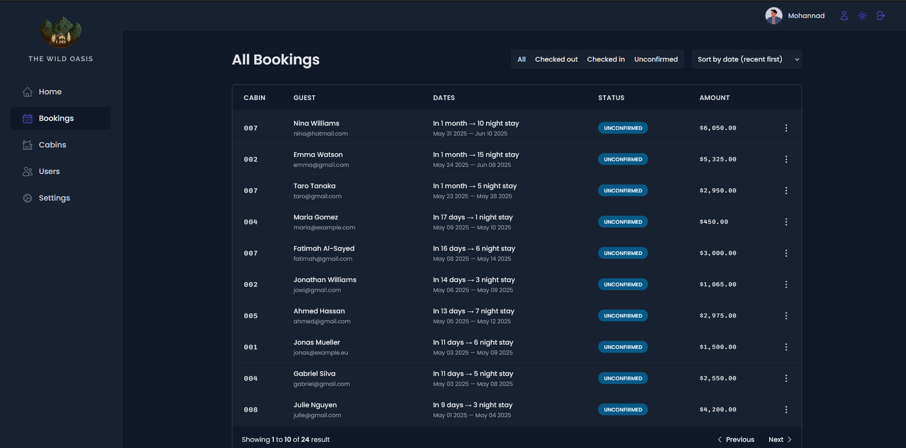
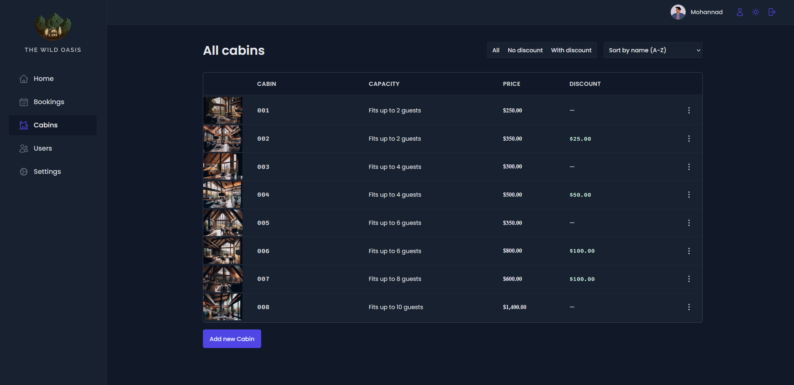
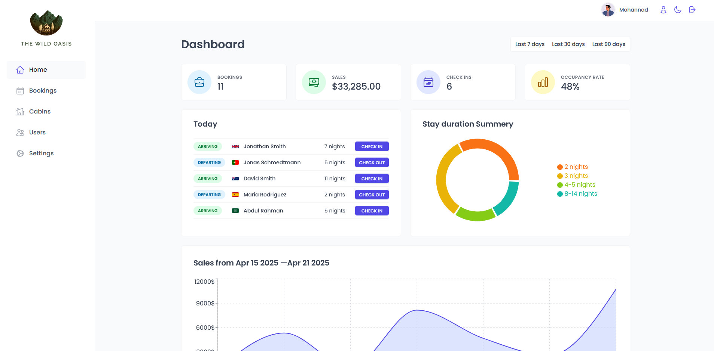
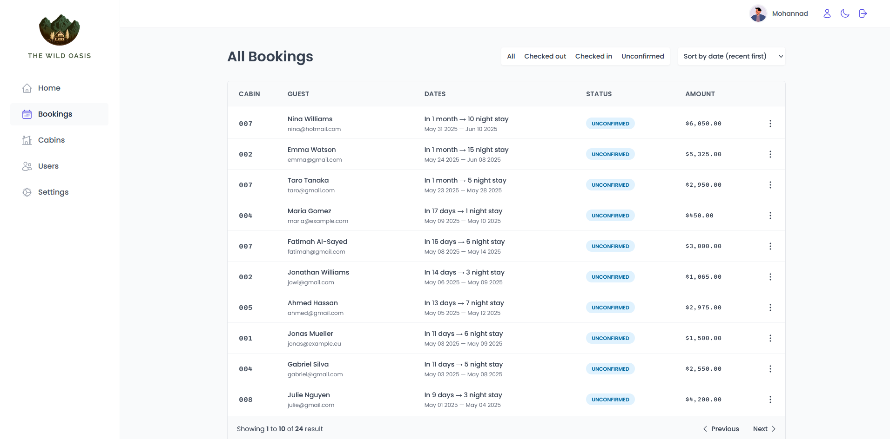
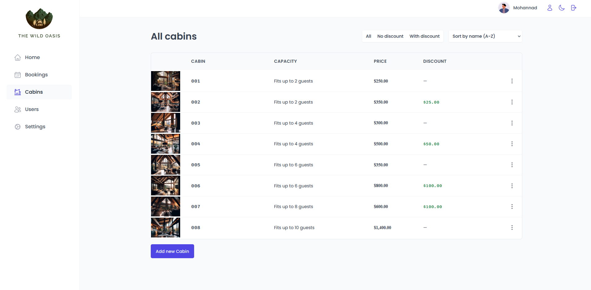

# The wild oasis

A dashboard with statistics for booking and reservation of cabins, From my journey of the react course

Username: testuser39876@gmail.com
password: Testuser13579))

### https://thewildoasis-mohannad.vercel.app/

## Tools / Libraries

- [React query](https://tanstack.com/query/latest)
- [React router](https://reactrouter.com/home)
- [Date FNS](https://date-fns.org/)
- [React error Boundary](https://www.npmjs.com/package/react-error-boundary)
- [React toast](https://react-hot-toast.com/)
- [React icons](https://react-icons.github.io/react-icons/)
- [Recharts](https://recharts.org/en-US/)
- [Styled components](https://styled-components.com/)

## Overview

#### Dark mode

#### Light mode

